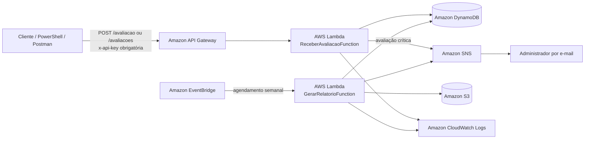

# Plataforma Serverless de Avaliações

Projeto desenvolvido para recebimento, classificação, armazenamento e análise de avaliações utilizando uma arquitetura serverless na AWS.

A solução expõe uma API protegida por API Key para envio de avaliações, classifica automaticamente a urgência com base na nota, persiste os dados no DynamoDB, envia alertas por e-mail para avaliações críticas e gera relatórios semanais armazenados no Amazon S3.

## Sumário

- [Visão geral](#visão-geral)
- [Arquitetura](#arquitetura)
- [Fluxos da solução](#fluxos-da-solução)
- [Tecnologias utilizadas](#tecnologias-utilizadas)
- [Estrutura do projeto](#estrutura-do-projeto)
- [Endpoint](#endpoint)
- [Regras de classificação](#regras-de-classificação)
- [Funções serverless](#funções-serverless)
- [Recursos AWS](#recursos-aws)
- [Pré-requisitos](#pré-requisitos)
- [Execução local](#execução-local)
- [Deploy](#deploy)
- [Testes](#testes)
- [Relatório semanal](#relatório-semanal)
- [Monitoramento](#monitoramento)
- [Segurança e governança](#segurança-e-governança)
- [Evidências de funcionamento](#evidências-de-funcionamento)
- [Possíveis melhorias](#possíveis-melhorias)
- [Status do projeto](#status-do-projeto)

## Visão geral

A plataforma foi criada para processar avaliações contendo uma descrição e uma nota de `0` a `10`.

A partir da nota recebida, a aplicação:

1. valida os dados enviados;
2. classifica a urgência da avaliação;
3. salva a avaliação no DynamoDB;
4. envia um alerta por e-mail quando a avaliação é crítica;
5. gera periodicamente um relatório consolidado;
6. armazena esse relatório no S3;
7. envia o resumo do relatório por e-mail.

A infraestrutura é criada e atualizada por meio do AWS SAM e do AWS CloudFormation.

## Arquitetura



## Fluxos da solução

### Fluxo de recebimento de avaliação

```text
Cliente
→ API Gateway
→ Lambda ReceberAvaliacaoFunction
→ validação
→ classificação de urgência
→ DynamoDB
→ SNS, quando a avaliação for crítica
→ e-mail do administrador
```

### Fluxo de geração de relatório

```text
EventBridge
→ Lambda GerarRelatorioFunction
→ leitura do DynamoDB
→ cálculo dos indicadores
→ geração do arquivo de relatório
→ armazenamento no S3
→ envio do resumo por SNS
→ e-mail do administrador
```

## Tecnologias utilizadas

### Aplicação

- Java 21
- Spring Boot 3.5.3
- Spring Cloud Function
- Maven
- AWS SDK for Java v2

### AWS

- AWS Lambda
- Amazon API Gateway
- Amazon DynamoDB
- Amazon SNS
- Amazon S3
- Amazon EventBridge
- Amazon CloudWatch Logs
- AWS Identity and Access Management
- AWS CloudFormation
- AWS Serverless Application Model

### Ferramentas

- IntelliJ IDEA
- AWS CLI
- AWS SAM CLI
- Docker Desktop
- Git
- GitHub
- PowerShell

## Estrutura do projeto

```text
feedback-serverless/
├── ReceberAvaliacaoFunction/
│   ├── pom.xml
│   └── src/
│       └── main/
│           └── java/
│               └── br/com/techchallenge/feedback/
│                   ├── config/
│                   │   └── AwsConfig.java
│                   ├── domain/
│                   │   └── Urgencia.java
│                   ├── dto/
│                   │   ├── AvaliacaoRequest.java
│                   │   └── AvaliacaoResponse.java
│                   ├── repository/
│                   │   └── AvaliacaoRepository.java
│                   ├── service/
│                   │   ├── AvaliacaoService.java
│                   │   └── NotificacaoService.java
│                   └── FeedbackApplication.java
│
├── GerarRelatorioFunction/
│   ├── pom.xml
│   └── src/
│       └── main/
│           └── java/
│               └── br/com/techchallenge/feedback/relatorio/
│                   ├── config/
│                   │   └── AwsConfig.java
│                   ├── dto/
│                   │   ├── AvaliacaoDetalhe.java
│                   │   └── RelatorioResumo.java
│                   ├── repository/
│                   │   └── AvaliacaoRepository.java
│                   ├── service/
│                   │   └── RelatorioService.java
│                   └── RelatorioApplication.java
│
├── template.yaml
├── samconfig.toml
├── .gitignore
└── README.md
```

## Endpoint

### Enviar avaliação

A API disponibiliza duas rotas `POST`, ambas apontando para a mesma função Lambda:

```http
POST /avaliacao
POST /avaliacoes
```

A rota `/avaliacao` mantém aderência ao enunciado. A rota `/avaliacoes` permanece disponível por compatibilidade.

### URLs publicadas

O ID da API é gerado pelo CloudFormation. Para descobrir as URLs:

```powershell
aws cloudformation describe-stacks --stack-name feedback-serverless --region sa-east-1 --query "Stacks[0].Outputs[?OutputKey=='AvaliacaoApiUrl' || OutputKey=='AvaliacaoApiAlternativaUrl'].[OutputKey,OutputValue]" --output table
```

Formato:

```text
https://SEU_API_ID.execute-api.sa-east-1.amazonaws.com/Prod/avaliacao
https://SEU_API_ID.execute-api.sa-east-1.amazonaws.com/Prod/avaliacoes
```

### Autenticação

As duas rotas exigem API Key no cabeçalho:

```http
x-api-key: SUA_API_KEY
```

Chamadas sem chave retornam:

```text
403 Forbidden
```

A API Key é criada pelo AWS SAM junto com um Usage Plan. Ela não deve ser armazenada no repositório, no README ou em logs públicos.

Para localizar a chave criada:

```powershell
aws apigateway get-api-keys --include-values --region sa-east-1
```

### Corpo da requisição

```json
{
  "descricao": "A aula apresentou falha no áudio",
  "nota": 2
}
```

### Exemplo de chamada com PowerShell

```powershell
$apiId=(aws apigateway get-rest-apis --region sa-east-1 --query "items[?name=='feedback-serverless-api'].id | [0]" --output text); $apiKey=(aws apigateway get-api-keys --include-values --region sa-east-1 --query "items[?contains(stageKeys, '$apiId/Prod')].value | [0]" --output text); Invoke-RestMethod -Uri "https://$apiId.execute-api.sa-east-1.amazonaws.com/Prod/avaliacao" -Method Post -Headers @{"x-api-key"=$apiKey} -ContentType "application/json" -Body (@{descricao="Teste com API Key";nota=5} | ConvertTo-Json)
```

### Resposta esperada

```json
{
  "id": "2b18df2c-6ddb-45be-8a4d-4444582fb86e",
  "descricao": "A aula apresentou falha no áudio",
  "nota": 2,
  "urgencia": "CRITICA",
  "dataEnvio": "2026-07-20T22:43:06Z"
}
```

### Campos

| Campo | Tipo | Obrigatório | Regra |
|---|---:|---:|---|
| `descricao` | `String` | Sim | Não pode ser vazia |
| `nota` | `Integer` | Sim | Deve estar entre `0` e `10` |

## Regras de classificação

| Faixa da nota | Urgência |
|---|---|
| `0` a `3` | `CRITICA` |
| `4` a `6` | `MEDIA` |
| `7` a `10` | `BAIXA` |

As avaliações críticas geram uma publicação no tópico SNS configurado para notificações administrativas.

## Funções serverless

### ReceberAvaliacaoFunction

Responsável por:

- receber a requisição do API Gateway;
- validar descrição e nota;
- gerar um identificador UUID;
- calcular a urgência;
- registrar a data de envio em UTC;
- persistir a avaliação no DynamoDB;
- publicar alerta no SNS quando a urgência for `CRITICA`;
- retornar os dados processados ao cliente.

Nome da função na AWS:

```text
feedback-receber-avaliacao
```

### GerarRelatorioFunction

Responsável por:

- ser acionada periodicamente pelo EventBridge;
- consultar as avaliações dos últimos sete dias no DynamoDB;
- calcular o total de avaliações;
- calcular a média das notas;
- contar avaliações críticas, médias e baixas;
- agrupar a quantidade de avaliações por dia;
- listar descrição, nota, urgência e data de envio de cada avaliação;
- gerar um arquivo `.txt`;
- salvar o relatório no S3;
- publicar o resumo no SNS.

Nome da função na AWS:

```text
feedback-gerar-relatorio
```

## Recursos AWS

A stack cria os seguintes recursos:

| Recurso | Finalidade |
|---|---|
| API Gateway | Expor os endpoints HTTP protegidos por API Key |
| Lambda de recebimento | Processar e salvar avaliações |
| Lambda de relatório | Consolidar os dados periodicamente |
| DynamoDB | Armazenar as avaliações |
| SNS | Enviar alertas e relatórios por e-mail |
| S3 | Armazenar os relatórios gerados |
| EventBridge | Agendar a geração do relatório |
| CloudWatch Logs | Registrar logs das funções |
| IAM Roles | Conceder permissões mínimas às Lambdas |
| CloudFormation | Provisionar e atualizar a infraestrutura |

### Tabela DynamoDB

```text
feedback-avaliacoes
```

Estrutura de cada item:

```json
{
  "id": "uuid",
  "descricao": "texto da avaliação",
  "nota": 2,
  "urgencia": "CRITICA",
  "dataEnvio": "2026-07-20T22:43:06Z"
}
```

### Tópico SNS

```text
feedback-avaliacoes-criticas
```

O mesmo tópico é utilizado para:

- alertas de avaliações críticas;
- envio do relatório semanal.

### Bucket S3

O nome do bucket é gerado automaticamente pelo CloudFormation.

Exemplo do ambiente atual:

```text
feedback-serverless-relatoriosbucket-sm40c3a0sosr
```

Os arquivos são armazenados dentro do prefixo:

```text
relatorios/
```

Exemplo:

```text
relatorios/relatorio-semanal-2026-07-21.txt
```

## Pré-requisitos

Antes de executar o projeto, instale:

- Java 21
- Maven
- Docker Desktop
- AWS CLI
- AWS SAM CLI
- Git

Confirme as instalações:

```bash
java -version
mvn -version
docker info
aws --version
sam --version
git --version
```

Também é necessário configurar as credenciais da AWS:

```bash
aws configure
```

Verifique a identidade autenticada:

```bash
aws sts get-caller-identity
```

## Execução local

Na raiz do projeto:

```bash
sam validate
sam build
sam local start-api
```

A API ficará disponível em:

```text
http://127.0.0.1:3000/avaliacao
```

### Teste local com PowerShell

```powershell
Invoke-RestMethod -Method Post -Uri "http://127.0.0.1:3000/avaliacao" -ContentType "application/json; charset=utf-8" -Body (@{descricao="Teste local";nota=2} | ConvertTo-Json -Compress)
```

> Para persistência real no DynamoDB e publicação no SNS, a função deve estar implantada na AWS ou receber credenciais e variáveis de ambiente válidas.

## Deploy

### Validar

```bash
sam validate
```

### Compilar

```bash
sam build
```

### Primeiro deploy

```bash
sam deploy --guided
```

Durante o deploy, informe:

```text
Stack Name: feedback-serverless
Region: sa-east-1
Allow SAM CLI IAM role creation: Y
Confirm changes before deploy: Y
```

### Deploys seguintes

```bash
sam deploy --parameter-overrides AdminEmail="SEU_EMAIL"
```

O parâmetro `AdminEmail` é definido como `NoEcho`, evitando sua exibição nos outputs do CloudFormation.

Após o primeiro deploy, a AWS enviará uma mensagem de confirmação da assinatura SNS. É necessário clicar em:

```text
Confirm subscription
```

Sem essa confirmação, os e-mails de alerta e relatório não serão entregues.

### Deploy automatizado com GitHub Actions

O arquivo `.github/workflows/deploy.yml` executa checkout, configuração do Java 21, configuração das credenciais AWS, instalação do SAM CLI, validação, compilação e deploy.

O pipeline roda em pushes para a branch `main` e também pode ser iniciado manualmente.

Segredos configurados no GitHub:

```text
AWS_ACCESS_KEY_ID
AWS_SECRET_ACCESS_KEY
AWS_REGION
ADMIN_EMAIL
```

## Testes

### Verificar bloqueio sem API Key

```powershell
$apiId=(aws apigateway get-rest-apis --region sa-east-1 --query "items[?name=='feedback-serverless-api'].id | [0]" --output text); try { Invoke-WebRequest -Uri "https://$apiId.execute-api.sa-east-1.amazonaws.com/Prod/avaliacao" -Method Post -ContentType "application/json" -Body (@{descricao="Teste sem chave";nota=5} | ConvertTo-Json) } catch { [int]$_.Exception.Response.StatusCode }
```

Resultado esperado:

```text
403
```

### Testar avaliação com API Key

```powershell
$apiId=(aws apigateway get-rest-apis --region sa-east-1 --query "items[?name=='feedback-serverless-api'].id | [0]" --output text); $apiKey=(aws apigateway get-api-keys --include-values --region sa-east-1 --query "items[?contains(stageKeys, '$apiId/Prod')].value | [0]" --output text); Invoke-RestMethod -Uri "https://$apiId.execute-api.sa-east-1.amazonaws.com/Prod/avaliacao" -Method Post -Headers @{"x-api-key"=$apiKey} -ContentType "application/json" -Body (@{descricao="Teste com API Key";nota=5} | ConvertTo-Json)
```

Resultado esperado:

```text
urgencia : MEDIA
```

Para testar alerta crítico, use nota `1`. Para testar urgência baixa, use nota `9`.

### Verificar o DynamoDB

```bash
aws dynamodb scan --table-name feedback-avaliacoes --region sa-east-1
```

## Relatório semanal

A função de relatório é executada automaticamente pelo EventBridge e considera somente as avaliações enviadas nos últimos sete dias.

Agendamento configurado:

```text
cron(0 12 ? * MON *)
```

Isso corresponde a:

```text
Toda segunda-feira, às 12:00 UTC
```

### Executar manualmente

```bash
aws lambda invoke --function-name feedback-gerar-relatorio --payload "{}" --cli-binary-format raw-in-base64-out --region sa-east-1 resposta-relatorio.json
```

Verificar a resposta:

```powershell
Get-Content .\resposta-relatorio.json
```

Saída esperada:

```text
"OK"
```

### Descobrir o nome do bucket

```bash
aws cloudformation describe-stacks --stack-name feedback-serverless --region sa-east-1 --query "Stacks[0].Outputs[?OutputKey=='RelatoriosBucketName'].OutputValue" --output text
```

### Listar relatórios no S3

```bash
aws s3 ls s3://SEU_BUCKET/relatorios/ --region sa-east-1
```

### Baixar um relatório

```bash
aws s3 cp s3://SEU_BUCKET/relatorios/relatorio-semanal-AAAA-MM-DD.txt . --region sa-east-1
```

### Exemplo de relatório

```text
RELATÓRIO SEMANAL DE AVALIAÇÕES

Período: 2026-07-14T01:02:12Z até 2026-07-21T01:02:12Z
Data de geração: 2026-07-21T01:02:12Z
Total de avaliações: 5
Média das notas: 3,60

QUANTIDADE POR URGÊNCIA
- Críticas: 3
- Médias: 1
- Baixas: 1

QUANTIDADE DE AVALIAÇÕES POR DIA
- 2026-07-20: 4
- 2026-07-21: 1

DETALHES DAS AVALIAÇÕES

------------------------------
Descrição: A aula apresentou falha no áudio
Nota: 2
Urgência: CRITICA
Data de envio: 2026-07-20T22:43:06Z
```

## Monitoramento

Os logs das funções ficam disponíveis no Amazon CloudWatch Logs.

Grupos de log:

```text
/aws/lambda/feedback-receber-avaliacao
/aws/lambda/feedback-gerar-relatorio
```

### Consultar logs da função de recebimento

```bash
aws logs tail /aws/lambda/feedback-receber-avaliacao --since 10m --region sa-east-1
```

### Consultar logs da função de relatório

```bash
aws logs tail /aws/lambda/feedback-gerar-relatorio --since 10m --region sa-east-1
```

### Alarmes configurados

```text
feedback-receber-avaliacao-errors
feedback-gerar-relatorio-errors
```

Os alarmes monitoram a métrica `Errors` das duas funções Lambda e publicam no tópico SNS quando o limite é atingido.

### Métricas relevantes

No CloudWatch podem ser acompanhadas:

- quantidade de invocações;
- erros;
- duração;
- throttles;
- uso de memória;
- taxa de sucesso;
- falhas de integração;
- quantidade de requisições do API Gateway.

## Segurança e governança

A solução utiliza as seguintes medidas:

- autenticação por API Key no API Gateway;
- Usage Plan com limite mensal e controle de taxa;
- criptografia em repouso no DynamoDB;
- criptografia AES-256 no bucket S3;
- bloqueio de acesso público no bucket;
- permissões IAM separadas por função;
- política de escrita no DynamoDB apenas para a Lambda de recebimento;
- política de leitura no DynamoDB apenas para a Lambda de relatório;
- permissão de escrita no S3 apenas para a Lambda de relatório;
- permissão de publicação no SNS apenas para as funções que necessitam;
- e-mail administrativo recebido como parâmetro;
- logs centralizados no CloudWatch;
- infraestrutura versionada como código no `template.yaml`.

## Evidências de funcionamento

Os seguintes cenários foram validados:

- publicação da API no API Gateway;
- bloqueio de requisições sem API Key com resposta `403`;
- requisições autenticadas com API Key;
- execução da Lambda Java 21;
- gravação das avaliações no DynamoDB;
- classificação de urgência;
- envio de alerta crítico por SNS;
- confirmação da assinatura por e-mail;
- execução manual da função de relatório;
- leitura dos dados do DynamoDB;
- cálculo da média e distribuição;
- agrupamento da quantidade de avaliações por dia;
- listagem dos detalhes individuais das avaliações;
- geração do arquivo de relatório;
- armazenamento no S3;
- envio do relatório por e-mail;
- logs disponíveis no CloudWatch;
- alarmes de erro configurados no CloudWatch;
- pipeline de deploy validado no GitHub Actions.

## Possíveis melhorias

- utilizar Cognito ou JWT;
- criar uma API para consultar avaliações;
- substituir `Scan` por uma estratégia mais eficiente;
- adicionar paginação na leitura do DynamoDB;
- criar tópicos SNS separados para alertas e relatórios;
- gerar relatório em JSON, CSV ou PDF;
- adicionar testes unitários;
- adicionar testes de integração;
- adicionar Dead Letter Queue;
- adicionar idempotência;
- adicionar tracing com AWS X-Ray;
- criar dashboard de métricas;
- configurar retenção dos logs;
- aplicar versionamento e lifecycle no bucket S3.

## Status do projeto

- [x] API publicada
- [x] API protegida por API Key
- [x] Rotas `/avaliacao` e `/avaliacoes`
- [x] Persistência no DynamoDB
- [x] Classificação de urgência
- [x] Alertas críticos por SNS
- [x] Segunda função serverless
- [x] Relatório periódico
- [x] Relatório limitado aos últimos sete dias
- [x] Quantidade de avaliações por dia
- [x] Detalhes individuais das avaliações
- [x] Armazenamento no S3
- [x] Envio de relatório por e-mail
- [x] Infraestrutura como código
- [x] Monitoramento por CloudWatch
- [x] Alarmes de erro das Lambdas
- [x] Pipeline CI/CD
- [ ] Testes automatizados
- [ ] Diagrama exportado como imagem

## Autores

Eduardo Borges da Silva - RM369948
Rubens Felisberto Neto - RM370154
Heber Oswaldo Marques Mizuno - RM369455
Patrick Nascimento Andrade - RM369393